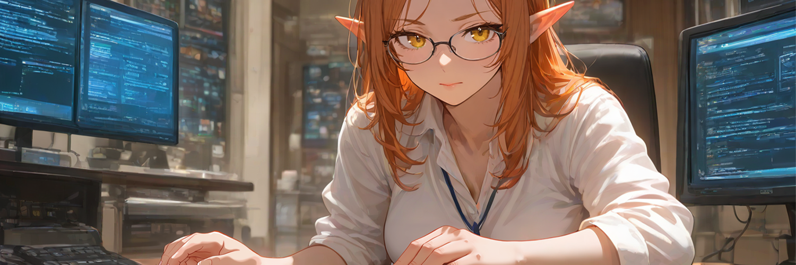

<h1 align="center">Hi there, I'm @nexd3v</h1>

  

<h3 align="center">Introduction to My Programming Journey</h3>

As a hobby enthusiast, I have always been fascinated by the world of programming.  My journey began with a simple yet profound interest in understanding how technology works,  and I have since developed a passion for learning programming skills for fun.  My ultimate goal is to build websites, read and discern code,  and potentially create web applications or even develop a game in the future.

<h3 align="center">Background and Motivation</h3>

My enthusiasm for programming stems from a desire to  explore the creative possibilities that technology offers.  I enjoy the challenge of solving problems  and the satisfaction of seeing projects come to life.  Over time, I have been self-teaching various programming concepts  and experimenting with different tools and technologies.

<h3 align="center">Skills and Aspirations</h3>

Currently, I am focusing on developing my skills in  programming languages and web development frameworks.  I aim to enhance my understanding of coding principles  and apply them to real-world projects.  My long-term aspirations include building dynamic websites,  creating interactive web applications,  and possibly venturing into game development.

<h3 align="center">Conclusion</h3>

Through this journey, I hope to not only acquire  technical skills but also foster a deeper appreciation  for the role of technology in modern society.  I am excited about the opportunities that lie ahead  and look forward to continuing my learning process,  driven by curiosity and a passion for innovation.

---

<h3 align="center">Some info about me</h3>

   🗫 I speak Norwegian & English 
   🌠I am currently learning Japanese 
   🥋 2. Kyu in Shotokan Karate 
   😠Gaming, Music, Anime, Manga 
   🛠️ Love to tinker with Minecraft modpacks

<h2 align="center">Currently Learning</h2>

  

<h3 align="center">Projects</h3>
    

        <a href="https://i.chzbgr.com/full/6070987520/hBA2B033B/soon">Personal Website</a> 
    

<!---
nexd3v/nexd3v is a ✨ special ✨ repository because its `README.md` (this file) appears on your GitHub profile.
You can click the Preview link to take a look at your changes.
--->
